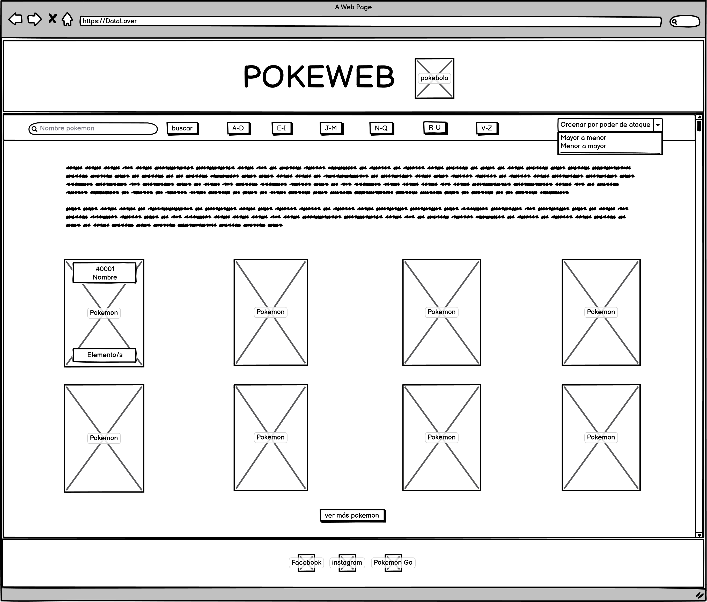
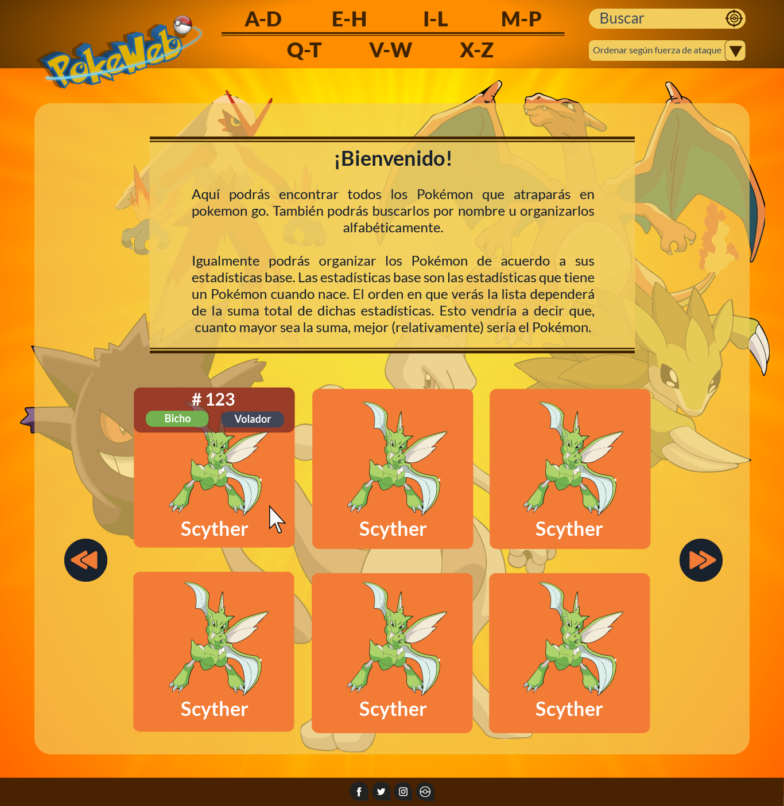

## POKEWEB

Nuestra POKEWEB esta pensada para niños entre 9 y 15 años, estratos 3 a 6 jugadores activos de pokemon go, que quieran conocer información y/o características de los pokemon que ofrece el juego para propósitos personales. Dichos niños deben poder acceder a un computador con internet y deben sabe cómo usar tanto el computador como navegar por la web.

Realizamos preguntas a jugadores reales, de los cuales encontramos los siguientes hallazgos:

* Los usuarios quieren poder ver las imágenes de los Pokémon con sus respectivos nombres y tipo/elemento.
para poder reconocerlos con mayor facilidad.

* Ver características de los Pokémon, tales como: ataques, fuerza de ataque, debilidades etc.
para poder decidir su estilo de pelea.

* Ordenarlos alfabéticamente los nombres de los Pokémon.

* Ordenar los Pokémon de acuerdo a sus estadísticas base, para decidir su estrategia de combate.

* Filtrar los Pokémon de acuerdo a su tipo/elemento para poder diferenciar y escoger algún Pokémon que necesite de acuerdo a la situación.

## Consideraciones generales

1- Basamos nuestra interfaz en el pokedex, en el sentido que muestra el listado de pokemones en la pagina principal, sin tener que navegar por otras vistas.

2- Muestra los filtros principales en la misma vista.

3- Mantiene la estética dentro de todo el concepto y no sólo en la pagina principal, manteniendo una gama de colores que va acorde con pokemon Go.

4- Tiene liks de acceso rapido al fanspage de facebook, instagram y al pokemon Go.

## Ideas a la obra
### Sketch

Se desarrollo la idea principal en balsamic para poder maquetear la base de nuestro proyecto.

### Mockup

Se desarrolló en Illustrator, teniendo como base los colores usados en el juego de pokemon rojo fuego; el remake del primer juego creado de pokemon para game boy.

